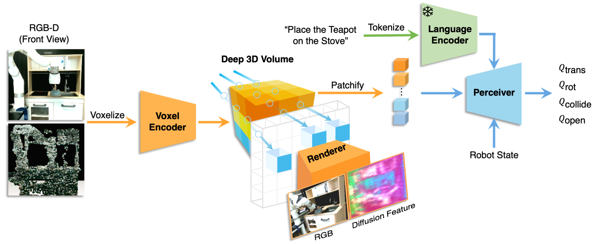

  <h1 align="center">GNFactor:
Multi-Task Real Robot Learning with   Generalizable Neural Feature Fields</h1>
<h2 align="center">CoRL 2023 Oral</h2>
  

    <a><strong>Yanjie Ze*</strong></a>
    ·
    <a><strong>Ge Yan*</strong></a>
    ·
    <a><strong>Yueh-Hua Wu*</strong></a>
    ·
    <a><strong>Annabella Macaluso</strong></a>
    ·
    <a><strong>Yuying Ge</strong></a>
    ·
    <a><strong>Jianglong Ye</strong></a>
    ·
    <a><strong>Nicklas Hansen</strong></a>
    ·
    <a><strong>Li Erran Li</strong></a>
    ·
    <a><strong>Xiaolong Wang</strong></a>
  

<h3 align="center">
  <a href="https://yanjieze.com/GNFactor/"><strong>Project Page</strong></a>
  |
  <a href=""><strong>arXiv</strong></a>
</h3>

  

#### Code is coming soon.  You could send an email to `lastyanjieze@gmail.com` for the code request. We would notify you upon releasing.
